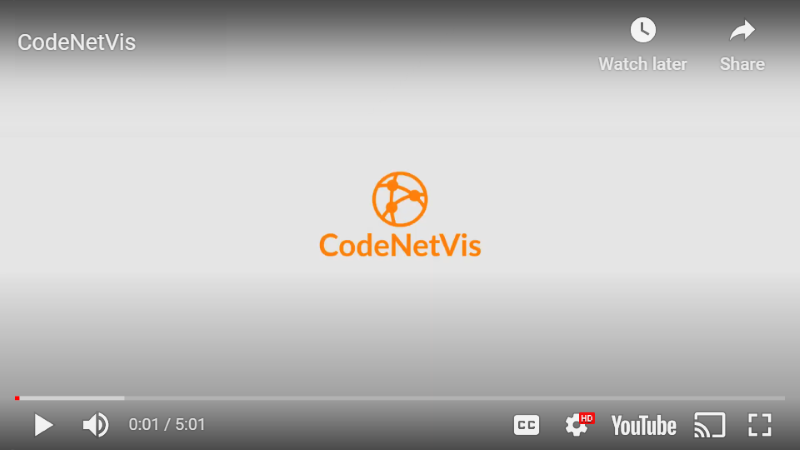
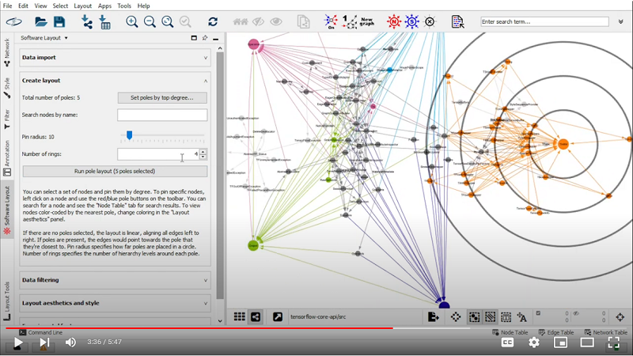

# CodeNetVis

Contributors: Mykyta Shvets, Ehsan Moradi, Debajyoti Mondal

**CodeNetVis** is an app for Cytoscape 3.9.1+ that allows you to
visualize and explore the dependency graph of a software
system.

The app can create a visualization treating
selected packages as magnetic poles. The dependencies are
visualized such that the directed paths are aligned along
the magnetic fields. This creates an easy-to-explore
visualization of the dependencies around the poles.
  

<a href="https://apps.cytoscape.org/apps/codenetvis"> Open on Cytoscape app store</a>

### Highlighted Usages

- Revealing class dependencies, which may be used to understand how 
  bugs may propagate  across modules or for planning software testing 
  
- Finding opportunities for code restructuring, which may be used to find 
  classes that are related to each other but belong to different packages and thus to reorganize the structure
  
- Using polar layout to select a set of classes and examine the dependencies 
  around them, which may be used to plan how to extract them out to create independent modules

- **New in v1.1:** Visualizing git repository commit information, such as the most recent changes, 
  commit authors, and the total number of commits.

---

### Introductory Video

### Quick Preview

 

---
### Installation

Go to [CodeNetVis app page](https://apps.cytoscape.org/apps/codenetvis) on the Cytoscape App Store and click the "Install" button. 

Alternatively, follow the instructions below:

1. First install Cytoscape 3.9.1+ from [their official website](https://cytoscape.org/).

2. Download the app .JAR file from 
[this repository](https://github.com/vgalab/CodeNetVis/raw/master/target/codenetvis-1.0.jar).

3. Copy the .JAR file into the folder
`%userprofile%\CytoscapeConfiguration\3\apps\installed`

4. Launch Cytoscape. A panel with the title  **Software Layout**
should appear to the left of the editor.

### Building the App

Required: install Maven 3.8.x, Java SDK 11.0.x, IntelliJ IDEA

1. Clone the project

2. Open pom.xml, press "build file" to resolve dependencies

3. Use `mvn install` command to compile into a jar

4. Move the resulting `target/*.jar`
   to `%userprofile%/CytoscapeConfiguration/3/apps/installed/`

5. You can set up a shell script that performs 3 & 4 in succession, for example: `mvn install && cp [PATH]/*.jar [PATH]`

---
### Tutorial Video

### Sample GitHub links to try out with CodeNetVis

- https://github.com/BJNick/CytoscapeMagneticLayout
- https://github.com/TheAlgorithms/Java
- https://github.com/google/guava
- https://github.com/ReactiveX/RxJava
- https://github.com/MinecraftForge/MinecraftForge
- https://github.com/tensorflow/java

---
### Libraries Used

<!-- This code uses the following libraries:
They are built into the app, so no need to install them separately.-->

- https://github.com/cytoscape/cytoscape-api
- https://github.com/gousiosg/java-callgraph/
- https://github-api.kohsuke.org/
- https://github.com/zeroturnaround/zt-zip/
- https://github.com/javaparser/javaparser

